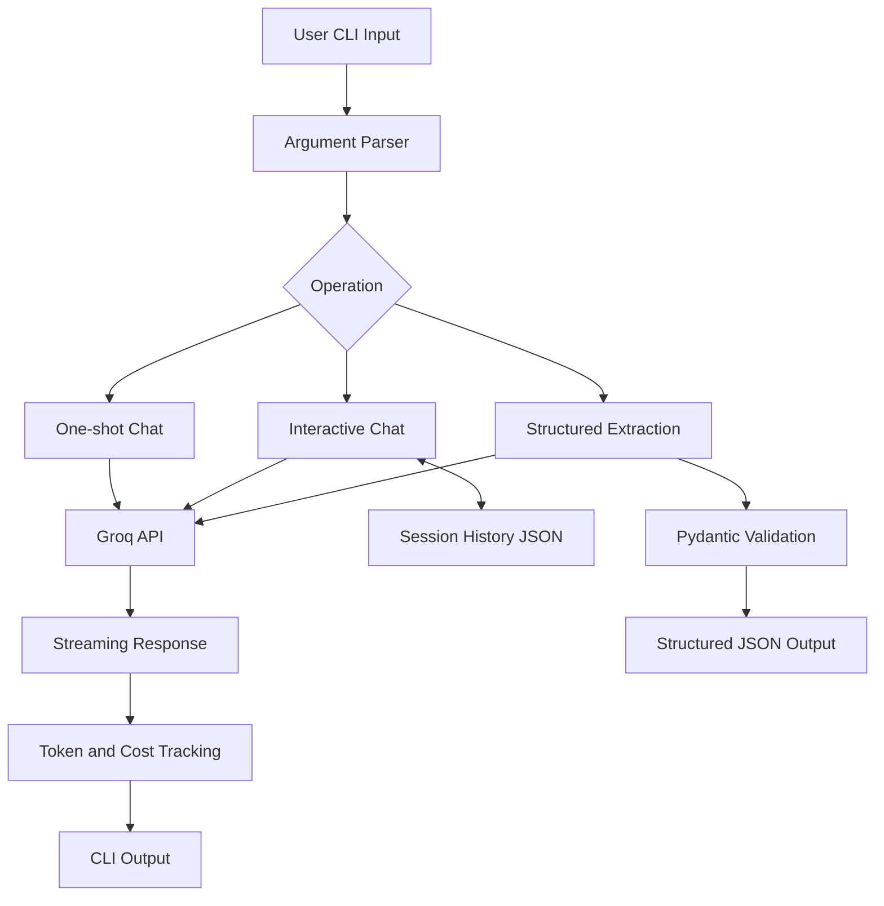

## Architecture

```mermaid
graph TD
    A[User CLI Input] --> B[Argument Parser]
    B --> C{Operation}
    C --> D[One-shot Chat]
    C --> E[Interactive Chat]
    C --> F[Structured Extraction]
    D --> G[Groq API]
    E --> G
    F --> G
    E <--> H[Session History JSON]
    G --> I[Streaming Response]
    I --> J[Token and Cost Tracking]
    J --> K[CLI Output]
    F --> L[Pydantic Validation]
    L --> M[Structured JSON Output]
```

